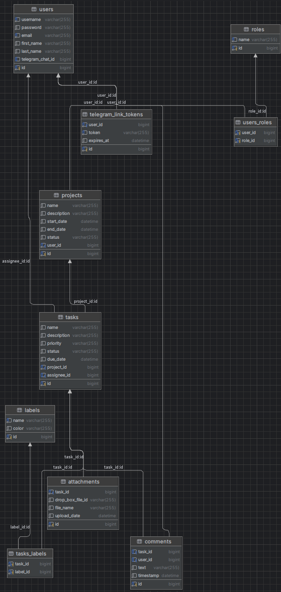
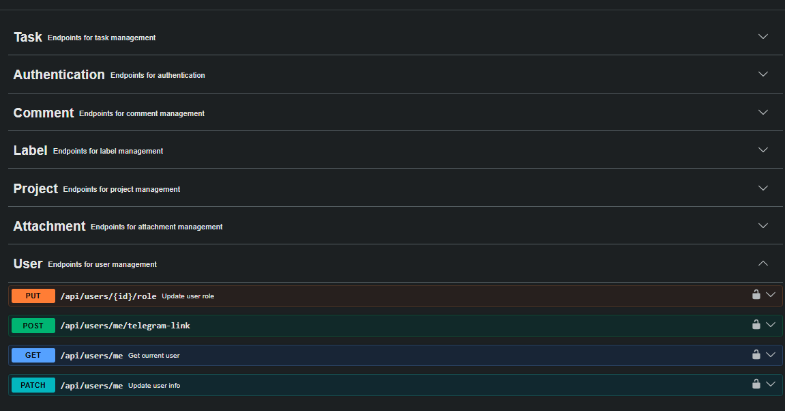
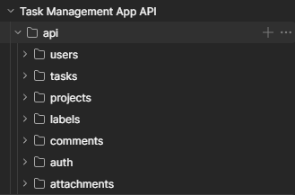

# ✅ Task Management App


Task Management App is an educational pet project developed with Spring Boot to demonstrate a modern RESTful backend for project and task collaboration. The application supports user registration and JWT authentication, role-based project and task administration, task assignment, status updates, labels, comments, file attachments through Dropbox, and Telegram notifications for task activity. It was created to gain hands-on experience with Spring Boot, Spring Security, JPA/Hibernate, Liquibase, Docker, Testcontainers, external API integration, and production-style layered backend architecture.

## 🖼️ Visuals

### 🗄️ Database Diagram


### 🔄 API Flow / Screenshots

#### Swagger UI


#### Postman Collection


## 🛠️ Technologies

- Java 17
- Spring Boot 4
- Spring Web MVC
- Spring Security
- JWT authentication
- Spring Data JPA
- Hibernate
- MySQL 8.4
- Liquibase database migrations
- MapStruct
- Lombok
- Bean Validation
- Swagger / OpenAPI via Springdoc
- Docker and Docker Compose
- Maven
- JUnit, Mockito, Spring Security Test, and Testcontainers
- Dropbox SDK
- Telegram Bot API integration
- Checkstyle

## ✨ Features

- User registration and login with JWT-based authentication
- Role-based authorization for admin and regular user actions
- Current user profile lookup and update
- Admin user role management
- Telegram account link token generation
- Project creation, lookup, update, deletion, and pagination
- Task creation, lookup, update, deletion, pagination, and search
- Current assignee task listing
- Task status updates by assignees
- Label creation, update, deletion, listing, and task assignment
- Comment creation, lookup by task, and deletion with access checks
- Attachment upload, listing, download, and deletion
- Dropbox-backed file storage
- Telegram notifications for task assignment, comments, status changes, and deadlines
- Liquibase-managed database schema
- Swagger UI for API exploration
- Unit and integration tests for services, repositories, and controllers

## Controller Overview

### 🔐 Authentication Controller

Base path: `/api/auth`

| Method | Endpoint | Description | Access |
| --- | --- | --- | --- |
| `POST` | `/api/auth/register` | Register a new user | Public |
| `POST` | `/api/auth/login` | Authenticate a user and return a JWT token | Public |

### 👤 User Controller

Base path: `/api/users`

| Method | Endpoint | Description | Access |
| --- | --- | --- | --- |
| `GET` | `/api/users/me` | Get the authenticated user's profile | Authenticated |
| `PATCH` | `/api/users/me` | Update the authenticated user's profile | Authenticated |
| `PUT` | `/api/users/{id}/role` | Update a user's role | Admin |
| `POST` | `/api/users/me/telegram-link` | Generate a Telegram link token | Authenticated |

### 📁 Project Controller

Base path: `/api/projects`

| Method | Endpoint | Description | Access |
| --- | --- | --- | --- |
| `POST` | `/api/projects` | Create a new project | Admin |
| `GET` | `/api/projects` | Get paginated projects owned by the authenticated user | Admin |
| `GET` | `/api/projects/{id}` | Get a project by id | Admin |
| `PUT` | `/api/projects/{id}` | Update a project | Admin |
| `DELETE` | `/api/projects/{id}` | Delete a project | Admin |

### ✅ Task Controller

Base path: `/api/tasks`

| Method | Endpoint | Description | Access |
| --- | --- | --- | --- |
| `POST` | `/api/tasks` | Create a new task | Admin |
| `GET` | `/api/tasks` | Get paginated tasks by project id | Admin |
| `GET` | `/api/tasks/me` | Get paginated tasks assigned to the authenticated user | Authenticated |
| `GET` | `/api/tasks/{id}` | Get a task by id | Authenticated with task access |
| `PUT` | `/api/tasks/{id}` | Update task details | Admin |
| `PUT` | `/api/tasks/{id}/status` | Update task status | Task assignee |
| `DELETE` | `/api/tasks/{taskId}` | Delete a task | Admin |
| `POST` | `/api/tasks/{taskId}/labels/{labelId}` | Add a label to a task | Admin |
| `DELETE` | `/api/tasks/{taskId}/labels/{labelId}` | Remove a label from a task | Admin |
| `GET` | `/api/tasks/search` | Search tasks by supported parameters | Admin |

Supported task search parameters:

- `status`
- `priority`
- `assigneeId`
- `projectId`
- `dueDateFrom`
- `dueDateTo`
- `name`

### 🏷️ Label Controller

Base path: `/api/labels`

| Method | Endpoint | Description | Access |
| --- | --- | --- | --- |
| `POST` | `/api/labels` | Create a new label | Admin |
| `GET` | `/api/labels` | Get paginated labels | Authenticated |
| `PUT` | `/api/labels/{id}` | Update a label | Admin |
| `DELETE` | `/api/labels/{id}` | Delete a label | Authenticated |

### 💬 Comment Controller

Base path: `/api/comments`

| Method | Endpoint | Description | Access |
| --- | --- | --- | --- |
| `POST` | `/api/comments` | Create a new comment for a task | Authenticated with task access |
| `GET` | `/api/comments?taskId={taskId}` | Get paginated comments for a task | Authenticated with task access |
| `DELETE` | `/api/comments/{id}` | Delete a comment | Admin or comment author |

### 📎 Attachment Controller

Base path: `/api/attachments`

| Method | Endpoint | Description | Access |
| --- | --- | --- | --- |
| `POST` | `/api/attachments?taskId={taskId}` | Upload an attachment to a task | Authenticated with task access |
| `GET` | `/api/attachments?taskId={taskId}` | Get paginated attachments for a task | Authenticated with task access |
| `GET` | `/api/attachments/{id}/download` | Download an attachment | Authenticated with task access |
| `DELETE` | `/api/attachments/{id}` | Delete an attachment | Authenticated with task access |

## 🚀 Getting Started

### ✅ Prerequisites

Install the following tools:

- Java 17+
- Docker Desktop
- Maven, or use the included Maven wrapper
- A Dropbox app with app key, app secret, and refresh token
- A Telegram bot token

### 📥 Clone the Repository

Clone the project from GitHub:

```bash
git clone https://github.com/<your-username>/<your-repository-name>.git
```

Or with SSH:

```bash
git clone git@github.com:<your-username>/<your-repository-name>.git
```

Move into the project directory:

```bash
cd <your-repository-name>
```

### ⚙️ Environment Variables

Create a `.env` file in the project root. You can copy the template:

```bash
cp .env.template .env
```

For Windows PowerShell:

```powershell
Copy-Item .env.template .env
```

Default values from `.env.template`:

```env
MYSQLDB_USER=root
MYSQLDB_USERNAME=root
MYSQLDB_PASSWORD=change-me
MYSQLDB_ROOT_PASSWORD=change-me
MYSQLDB_DATABASE=task_management_app

MYSQLDB_LOCAL_PORT=3307
MYSQLDB_DOCKER_PORT=3306

SPRING_LOCAL_PORT=8081
SPRING_DOCKER_PORT=8080
DEBUG_PORT=5005

JWT_EXPIRATION_TIME=3000000000000
JWT_SECRET=replace-with-a-long-random-secret

DROPBOX_APP_KEY=replace-with-dropbox-app-key
DROPBOX_APP_SECRET=replace-with-dropbox-app-secret
DROPBOX_REFRESH_TOKEN=replace-with-dropbox-refresh-token

TELEGRAM_BOT_TOKEN=replace-with-telegram-bot-token
```

Do not commit real secrets. Keep production and local credentials outside version control.

## ▶️ Run the Project

### 🐳 Option 1: Run with Docker Compose

Build the application first:

```bash
./mvnw clean package
```

On Windows PowerShell:

```powershell
.\mvnw.cmd clean package
```

Start MySQL and the application:

```bash
docker compose up --build
```

The API will be available at:

```text
http://localhost:8081
```

Swagger UI:

```text
http://localhost:8081/swagger-ui/index.html
```

### 💻 Option 2: Run Locally with MySQL in Docker

Start only the MySQL service:

```bash
docker compose up mysqldb
```

Run the application:

```bash
./mvnw spring-boot:run
```

On Windows PowerShell:

```powershell
.\mvnw.cmd spring-boot:run
```

If you run locally against the Docker MySQL service, make sure `spring.datasource.url` points to the exposed local port, for example:

```properties
spring.datasource.url=jdbc:mysql://localhost:3307/task_management_app
```

## 🔑 Authentication

Public endpoints are available under `/api/auth/**`. Other endpoints require authentication.

1. Register a user with `POST /api/auth/register`.
2. Log in with `POST /api/auth/login`.
3. Copy the returned token.
4. Send authenticated requests with this header:

```http
Authorization: Bearer <your-jwt-token>
```

Role-based access is enforced with Spring Security. Admin-only operations require the `ADMIN` authority.

## 📖 API Documentation

After the application starts, open Swagger UI:

```text
http://localhost:8081/swagger-ui/index.html
```

OpenAPI JSON is available at:

```text
http://localhost:8081/v3/api-docs
```

## 🗃️ Database

The application uses MySQL and Liquibase. Database changes are stored in:

```text
src/main/resources/db/changelog
```

Liquibase creates tables for:

- Users and roles
- Projects
- Tasks
- Labels
- Task-label relations
- Comments
- Attachments
- Telegram link tokens

## 🧪 Testing

Run all tests:

```bash
./mvnw test
```

On Windows PowerShell:

```powershell
.\mvnw.cmd test
```

Run controller integration tests:

```bash
./mvnw -Dtest="*ControllerTest" test
```

On Windows PowerShell:

```powershell
.\mvnw.cmd -Dtest="*ControllerTest" test
```

The test setup includes:

- Controller integration tests with Spring MockMvc
- Service unit tests with Mockito
- Custom repository/specification tests
- Testcontainers-backed MySQL integration testing
- SQL fixtures in `src/test/resources/database`

Docker must be running for tests that use Testcontainers.

## 📬 Postman Collection

Add a ready-to-import Postman collection here when available:

- [Download Postman Collection](docs/postman/BookStoreAPI.postman_collection.json)

### 📥 Import into Postman

1. Open Postman.
2. Click **Import**.
3. Select the collection JSON file.
4. Start the application at `http://localhost:8081`.
5. Run the registration and login requests.
6. Save the JWT token for authenticated requests.

Create an environment with:

```text
baseUrl=http://localhost:8081
token=<JWT token from /api/auth/login>
```

Use `{{baseUrl}}` in request URLs and `Bearer {{token}}` in the Authorization tab.

## 🧩 Challenges and Solutions

- Authentication and authorization: JWT authentication is combined with Spring Security and method-level access checks to separate public, authenticated, admin-only, assignee-only, and owner-scoped operations.
- Task access control: A dedicated access service checks whether the authenticated user is an admin or the task assignee before allowing task-related actions.
- Database consistency: Liquibase migrations keep schema creation repeatable across local, Docker, and test environments.
- DTO mapping: MapStruct reduces repetitive conversion code between entities and API DTOs.
- Search flexibility: Specification-based repositories support extensible task search logic without hardcoding query combinations.
- External file storage: Dropbox integration keeps uploaded file content outside the database while the app stores attachment metadata.
- Notifications: Telegram integration sends task-related messages without coupling controller logic to notification delivery.
- Testing persistence behavior: Testcontainers and SQL fixtures allow controller integration tests to run against a real MySQL database.

## 📁 Project Structure

```text
src/main/java/com/example/taskmanagementapp
|-- config
|-- controller
|-- dto
|-- exception
|-- mapper
|-- model
|-- repository
|-- security
|-- service
`-- validation
```

## 👤 Author

- **Name:** Andrii Lotoshynskyi
- **GitHub:** [AndriiLoto](https://github.com/AndriiLoto)
- **LinkedIn:** [Andrii Lotoshynskyi](https://www.linkedin.com/in/andrii-lotoshinskyi-a91196215/)
- **Email:** wetwettew@gmail.com
